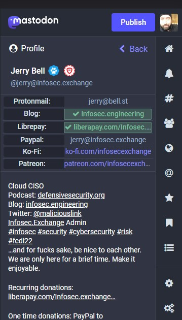
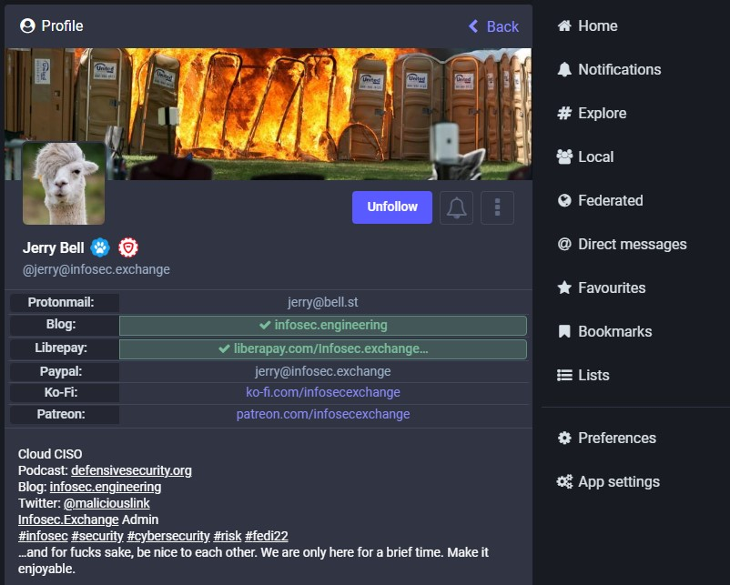
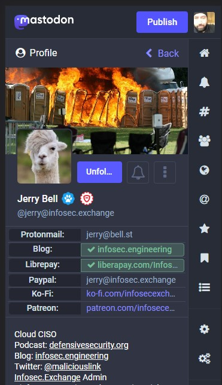
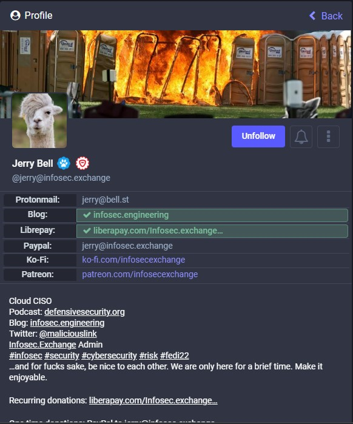

# csswork
some tests by me.

# Version 1 is in customcss1.css
### and look like this in mobile

## and look like this in desktop

If you like these two > get this css  file [custom.css](customcss1.css)
and replace with your custom.css.

# Version 2 is in customcss1.css
### and look like this in mobile

## and look like this in desktop

If you like these two > get this css  file [custom.css](customcss2.css)
and replace with your custom.css.

PS:
additionally I suggest, in accountscss:330

.account__header__fields dl {

border-bottom: 1px solid #42485a;  <= we can remowe this since no need underline at all 
}

PSS: if we have an option to play with (instead of DL DT)
perhaps ul / li (symantically make more sense to me imho)
I will work on it a bit more to make it more appeal as possible and maybe makes some icons too

